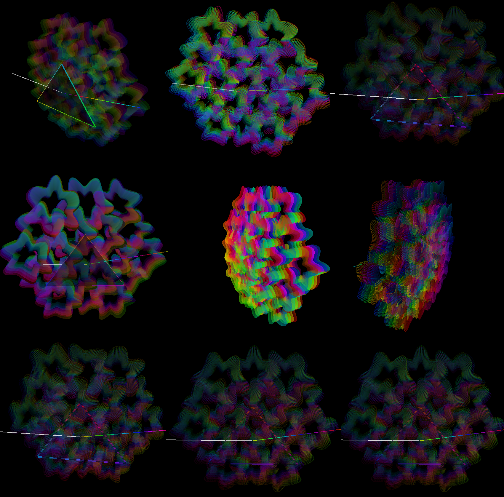

# Atividades da Aula 6 — Computação Gráfica com Pygame + OpenGL

Este projeto contém três atividades principais da Aula 6, cada uma explorando um conceito diferente em OpenGL, além de um arquivo bônus com uma visualização artística.



---

## Arquivos

### **1) atv_aula6_A.py — Pirâmide 3D**

- Desenho de uma pirâmide usando vértices e faces.
- Rotação contínua.
- Teste prático de `GL_TRIANGLES` e `GL_QUADS`.

### **2) atv_aula6_B.py — Cubo Iluminado**

- Cubo com normais por face.
- Luz difusa, ambiente e especular.
- Demonstração de iluminação básica em OpenGL.

### **3) atv_aula6_C.py — Esfera Paramétrica**

- Geração de esfera via coordenadas paramétricas.
- Normais suaves.
- Renderização com `GL_QUAD_STRIP`.

---

## **Arquivo bônus**

### **AEasterEgg_from_bill.py**

Uma visualização artística que combina:

- Flor da Vida volumétrica em 3D
- Transições suaves (“morph”)
- Formas e efeitos coloridos
- Estética prismática

**Não faz parte das atividades obrigatórias** — apenas um extra criativo.

---

## Como executar

```bash
python atv_aula6_A.py
python atv_aula6_B.py
python atv_aula6_C.py
python AEasterEgg_from_bill.py     # opcional
 Instalação
Instale as dependências:

bash
Copiar código
pip install -r requirements.txt
Recomendado usar ambiente virtual:

bash
Copiar código
python -m venv venv
source venv/bin/activate   # macOS/Linux
venv\Scripts\activate      # Windows
 Dependências
Tudo roda em:

Python 3.9+

Uma GPU/driver compatível com OpenGL

Bibliotecas usadas:

pygame

PyOpenGL

PyOpenGL_accelerate

 Observação
Todos os programas usam pygame.time.get_ticks() para animações, e fecham com ESC.

O arquivo bônus é totalmente opcional e existe apenas para demonstração estética.
```
